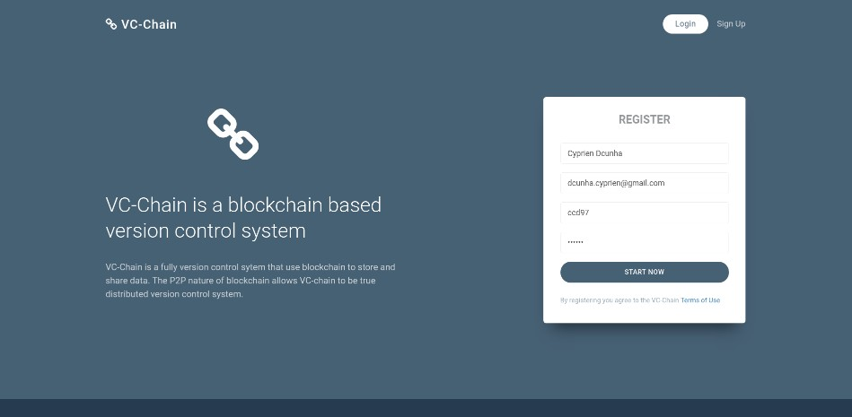
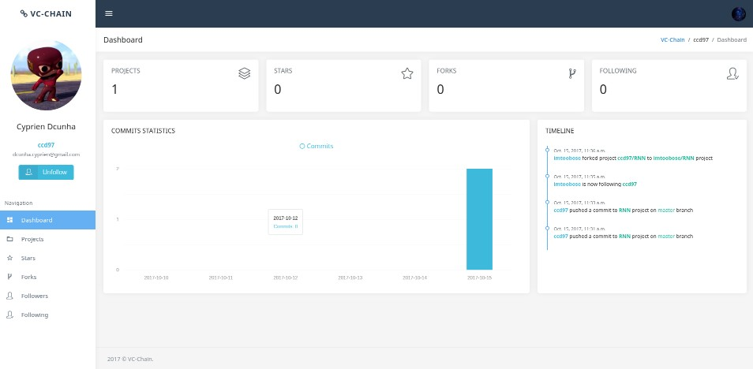
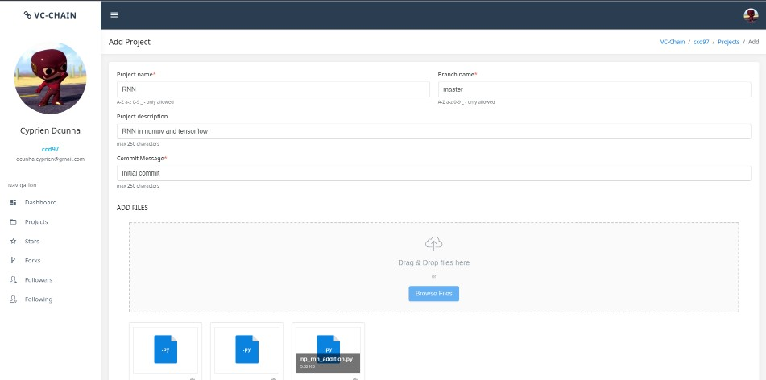
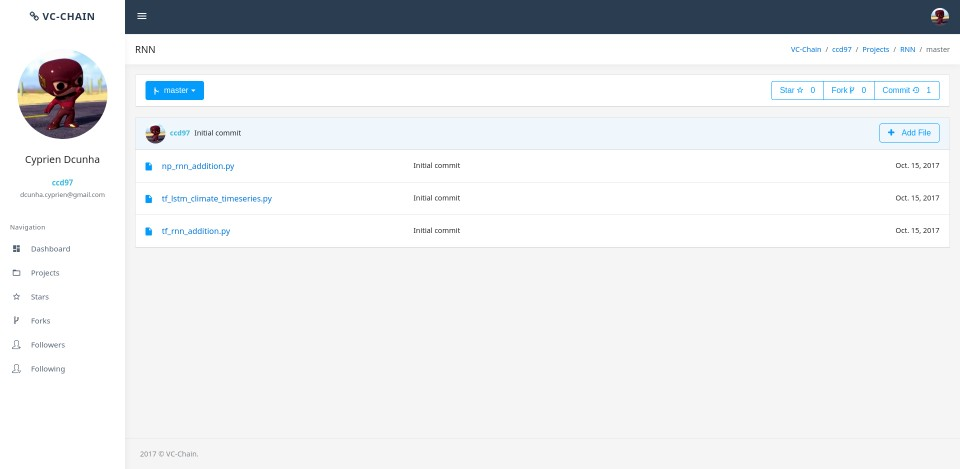
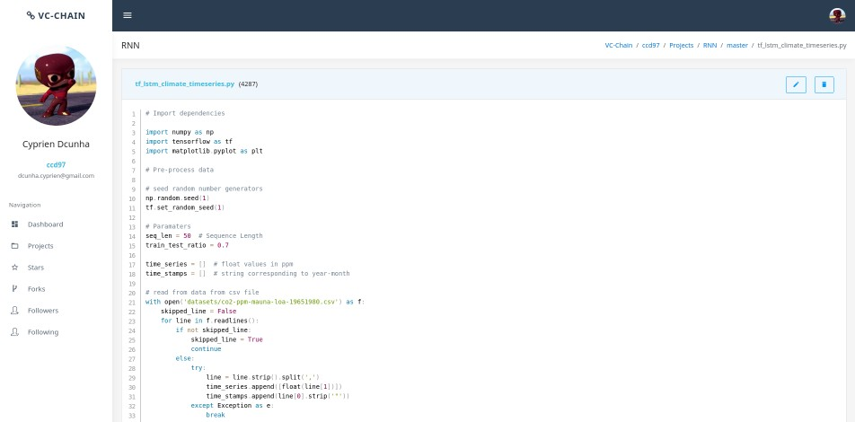
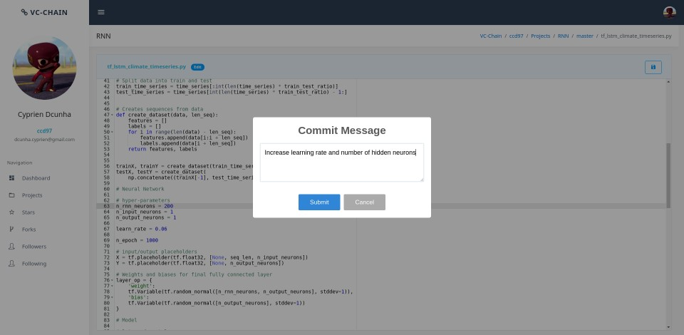
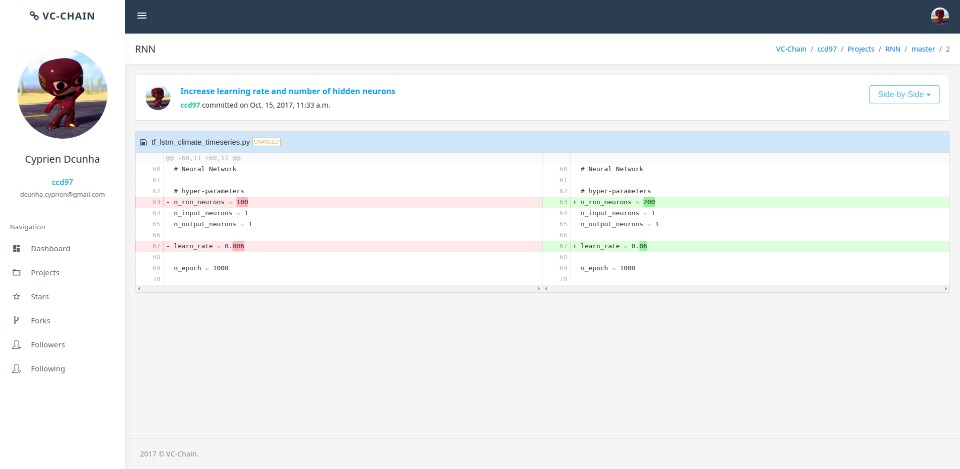
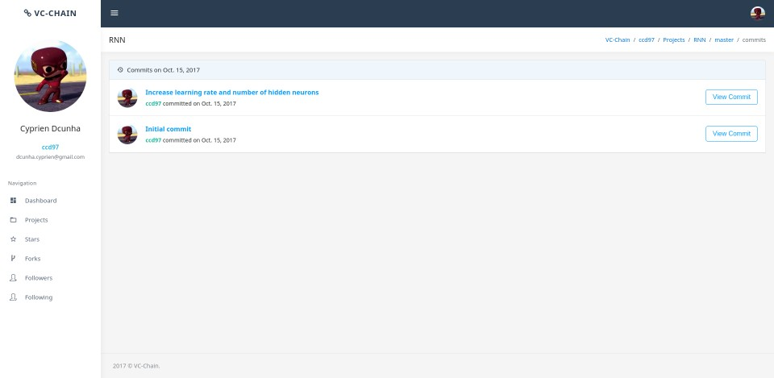

<h1 align="center">
  <br>
  	
  <br>
  VC-chain
  <br>
</h1>


<h4 align="center">VC-chain is a simple version control system.</h4>

<table>
<tr>
<td>
  This is a project developed as Web Technologies Mini-Project for academic year 2017-2018.
  It is a simple vesrion control system having features from git. A web UI to manage this system was main aim of our project.
</td>
</tr>
</table>

### Main features

* Create multiple projects
* Multiple file upload to create project
* Multiple branches support
* Changes as commits
* View Diff for commits
* Syntax highlighting
* Edit files in browser
* Proper Statistics
* Fork Project
* Star Project
* Follow People
* Customizable profile


### Varients

Branch     			| Description
-------------------	| -----------------------------------------
master     			| files are stored on a database
master-blkchain  	| files are stored on a blockchain (TODO)


##### Notes for blockchain varient
You need to run blockchain instance provided [here-todo](#) before running this project.<br>
Only file data is stored on blockchain; everything else in database.<br>
It's a simple blockchain and just a concept.

### Usage

This project requires [python3](https://www.python.org/) and [python3-django](https://www.djangoproject.com/) to run

To run the server

```
$ python3 manage.py makemigrations vc_chain
$ python3 manage.py migrate
$ python3 manage.py runserver
```

### Screenshots

Homepage | Dashboard
:-------:|:--------:
  |  

Project Upload | Project View
:-------------:|:--------------:
  |  

Code View | Code Edit
:-------------:|:--------------:
  |  

Diff Viewer | Commit View
:-------------:|:--------------:
  |  

### Team

* [Myself](https://github.com/ccd97)
* [AnasHacken](https://github.com/AnasHacken)

### Note
This is just a mini-project as a part of my college's curriculum.<br>
This may not have all features and might contains various issuse and bugs.<br>
